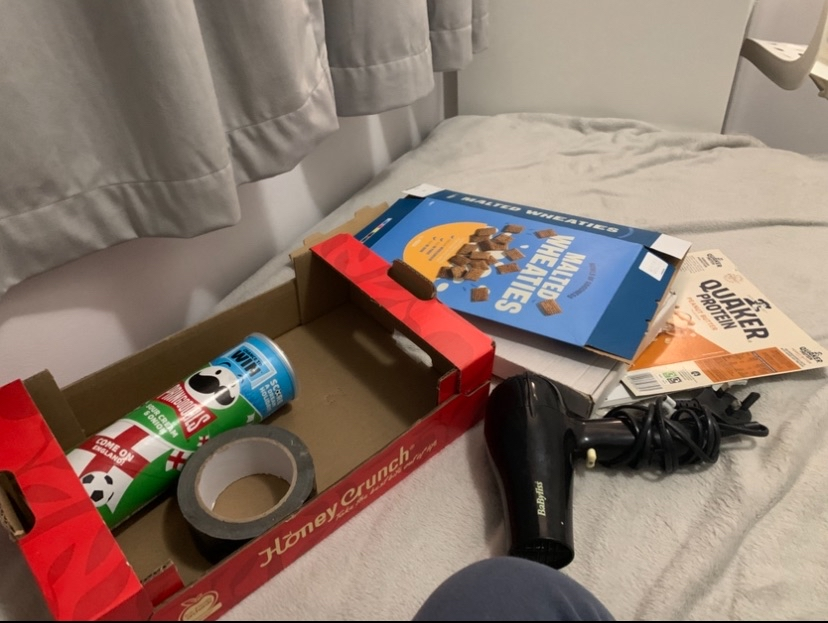
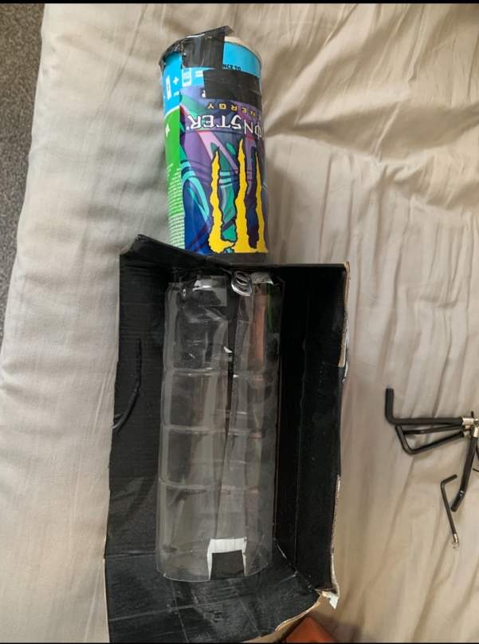
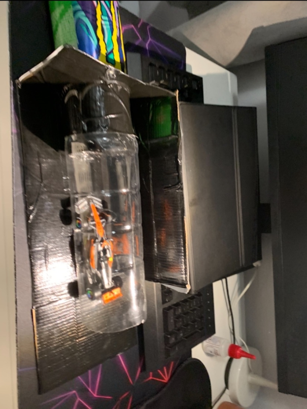
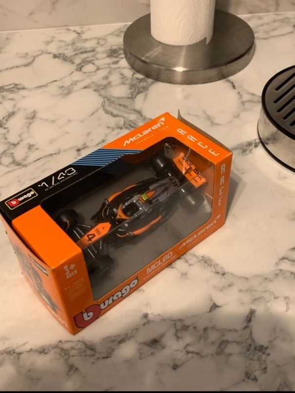

# Creating the Mini Wind Tunnel Mk I 🏎️💨

This started out of pure boredom and somehow turned into a lesson in airflow, improvisation and nearly setting fire to the house.

Here is how it came together step by step.

## 📝 Planning (or the lack of it)

The plan was simple: have no plan at all.  
Some cardboard boxes and trash were being thrown out so I took them for my “science mission.”

**Materials I used**  
- Cardboard boxes and basket.  
- Cereal boxes.  
- Pringles can.  
- Plastic soda bottle.  
- Duct tape the ultimate problem solver.  
- Hairdryer.  

I knew this idea was sketchy but that never stopped me.

## 🔨 Building

Cutting, taping and putting everything together.  
The Pringles can connects to the cardboard box which opens into the plastic bottle where the model sits.  
The whole lot was wrapped in duct tape so the smoke would be easier to see.

## 💨 Smoke Generation

The only issue was how to generate smoke.  
I decided to use matches and spare incense.

The cardboard box had a flap that could be closed, allowing smoke to build up in the Pringles can.  
For safety I stuck aluminium foil onto the bottom so the burning material wouldn't set the house on fire.

## 🏎️ The Test Model

Whilst this was the F1 model I used.

*I don't support McLaren. This was just the cheapest model. Red Bull all the way.*

## ✅ Lessons Learned

DIY wind tunnels work… kind of.  
Duct tape is the hero we all need.  
Even a messy setup can teach you something about airflow.

## 🎯 Next Steps

Build wind tunnel Mk II with proper flow straighteners and stronger materials.  
Improve smoke generation for clearer visualisation.  
Take photos and videos to actually see the airflow.  
Combine this with CFD to compare simulations with real smoke.

