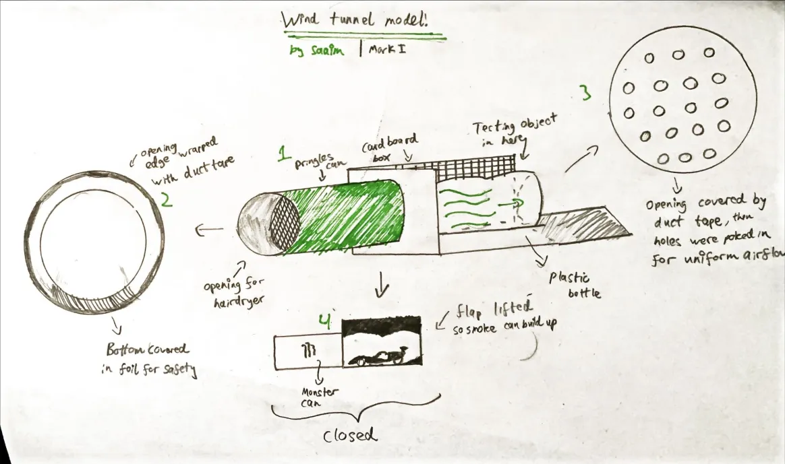

# Creating the Mini Wind Tunnel Mk I 🏎️💨

This started out of pure boredom and somehow turned into a lesson in airflow, improvisation and nearly setting fire to the house.

Here is how it came together step by step.

## 📝 Planning (or the lack of it)

The plan was simple: have no plan at all.  
Some cardboard boxes and trash were being thrown out so I took them for my “science mission".

**Materials I used**  
- Cardboard boxes and basket.  
- Cereal boxes.  
- Pringles can.  
- Plastic soda bottle.  
- Duct tape the ultimate problem solver.  
- Hairdryer.  

I knew this idea was sketchy but that never stopped me.

## ✏️ Sketching

I drew this sketch specifically for this portfolio, to explain how it was meant to work and my reasoning behind each decision.  

Excuse my drawing skills, as I am not a descendant of Picasso.  

Below are the explanations based on the numbers referenced on the sketch:

1. The whole structure itself, showing how it theoretically should work, with air flowing through the Pringles can, into the plastic bottle, and then out.  
2. The opening to the Pringles can. The edges can be covered with duct tape for extra grip on the hairdryer so it doesn’t come loose. Aluminium foil is added at the bottom for safety.  
3. The end of the Pringles can is covered in duct tape, and then I poked holes to try to create uniform flow. It failed, but I learnt a lot about airflow and pressure drops.  
4. Side view of the whole system. The monster can was purely for aesthetics, since I currently have caffeine running in my veins.  

## 🔨 Building

Cutting, taping and putting everything together.  
The Pringles can connects to the cardboard box which opens into the plastic bottle where the model sits.  
The whole lot was wrapped in duct tape so the smoke would be easier to see.

## 💨 Smoke Generation

The only issue was how to generate smoke.  
I decided to use matches and spare incense.

The cardboard box had a flap that could be closed, allowing smoke to build up in the Pringles can.  
For safety I stuck aluminium foil onto the bottom so the burning material wouldn't set the house on fire.

## 🏎️ The Test Model

Whilst this was the F1 model I used.

*I don't support McLaren. This was just the cheapest model. Red Bull all the way.*

## ✅ Lessons Learned

DIY wind tunnels work… kind of.  
Duct tape is the hero we all need.  
Even a messy setup can teach you something about airflow.

## 🎯 Next Steps

Take photos and videos to actually see the airflow.  
Look at the results and see where I can do better next time.

