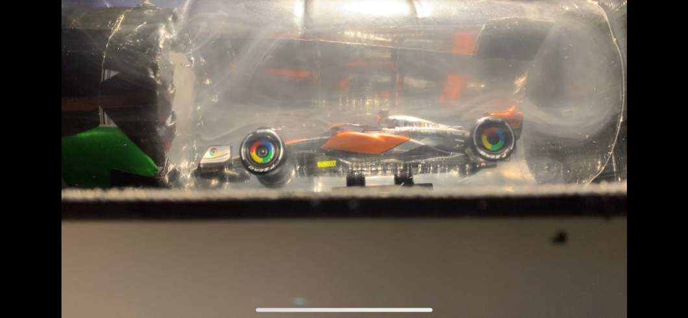
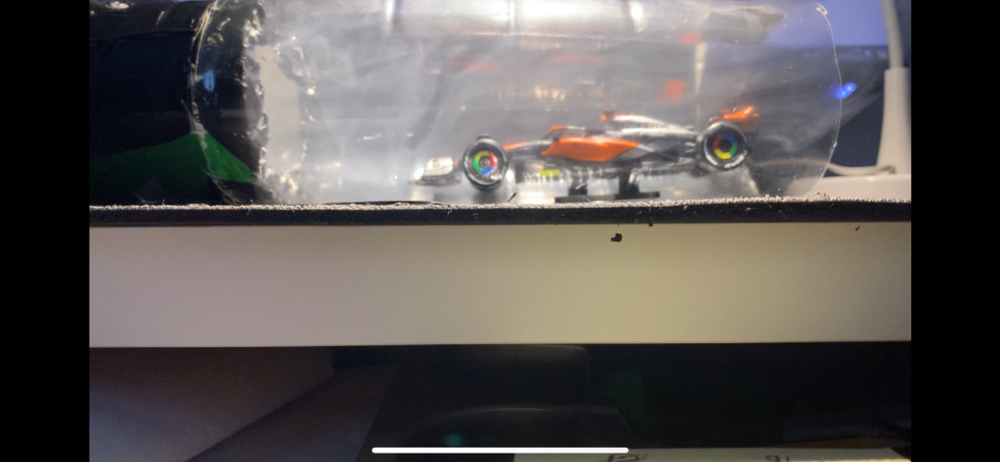
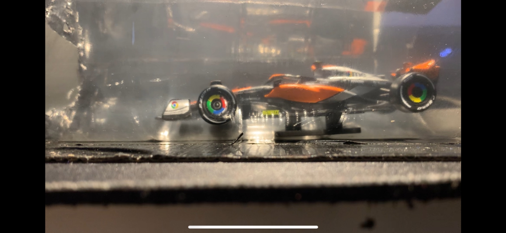
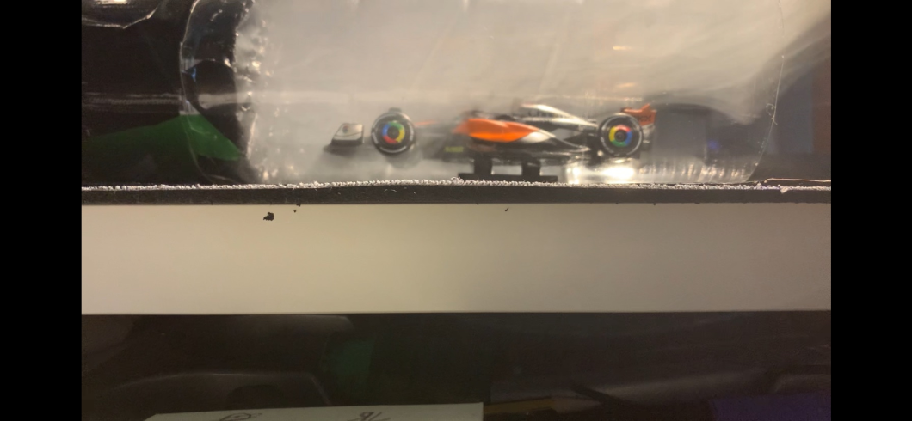
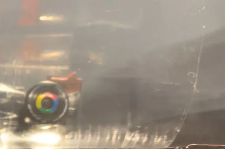

# 🌀 Testing

## 🔧 Setup

We made it. The testing stage. Honestly this was the most exciting part for me, since I usually never even make it this far before abandoning a project halfway. But here we are, smoke at the ready, hairdryer in hand.  

First thing I did was burn three matches and an incense stick, then shoved them into the little foil area I had made earlier. Closing the flap of cardboard kept more smoke inside the system so I could actually see something moving when the air hit.  

For the wind, I used a normal hairdryer. On the side it proudly says **2200 W**, but that number is almost all about the heat, not the air. To figure out how fast the air was actually moving, I looked up the usual flow rate for a dryer (one to two cubic metres a minute), then threw it into 
`v = Q / A`. Since the outlet was about the size of a drinks can, the numbers came out around ten to twenty five metres per second. Which is basically a car on the motorway blasting into my tiny cardboard tunnel. No wonder things got messy.  

Now, for my setup, that speed was way too much, and you’ll see exactly what I mean when you watch the videos.  

## 🎥 Tests

The videos below were the best of the bunch. There were plenty more, but most of them showed absolutely nothing except disappointment. 
I had to wait a few minutes every time for smoke to build up before switching on the hairdryer, but even then the visuals only lasted half a second before the smoke vanished. 
Turns out incense isn’t exactly Red Bull Racing levels of technology. I also decided to completely rip off the duct tape at the entrance to the main tunnel, since the holes weren't letting any air through.  

<table>
  <tr>
    <td>
      
      
Test 1

    </td>
    <td>
      
      
Test 2

    </td>
    <td>
      
      
Test 3

    </td>
  </tr>
</table>

## 🏆 Hall of Fame

Some of my favourite pictures from the tests. A few of these I actually stopped and stared at for a bit, because even in this scrappy tunnel there were moments where the smoke looked beautiful.  

<table>
  <tr>
    <td></td>
    <td></td>
  </tr>
  <tr>
    <td></td>
    <td></td>
  </tr>
</table>

Here’s also a close up of the rear wing of the model. You can just about see the smoke peeling off the surface and forming a faint trail.  

  

This little car was the perfect reminder of what wind tunnels are really about. Seeing the flow wrap around it, even for a split second, made the whole messy process worth it.  

## ✅ What Worked

This project was never meant for serious data. It was simply me, some scrap cardboard, and a desire to play engineer for a bit. And while it failed in a lot of ways, it also succeeded in teaching me far more than a PowerPoint slide ever could.  

I built something from scratch with zero budget, and the only thing I paid for was the model. I got real footage of airflow, even if it was short-lived. And yes, duct tape was the MVP again, making a dark backdrop that helped the smoke stand out.  

## ❌ What Did Not Work

The tunnel was leaky, the smoke too thin, the flow anything but uniform, and the giant plastic bottle made the smoke rise where the car wasn’t. Oh, and the hairdryer was ridiculously overpowered. The smoke never stood a chance.  

## 🚀 Next Time

I have a 3D printer now, so the structure will actually hold together. I want to look at how F1 teams design their tunnels, with the moving belt at the bottom. I’ll find a way to get denser smoke, maybe with a fog machine. I’ll stick an anemometer in there too, so I can measure the speed properly. And this time, I’ll design everything in SolidWorks before printing it on the Bambu A1.  

The goal is simple. Learn even more than before, by actually doing it.  

## 🏁 The End

Thanks for reading. I don’t think I’ll revisit this version again, but I’m already planning the sequel.  

**Mini Wind Tunnel Mark II. Coming soon!**

